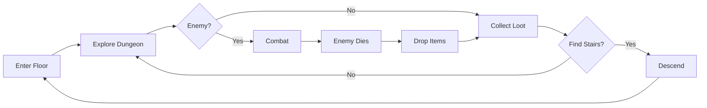
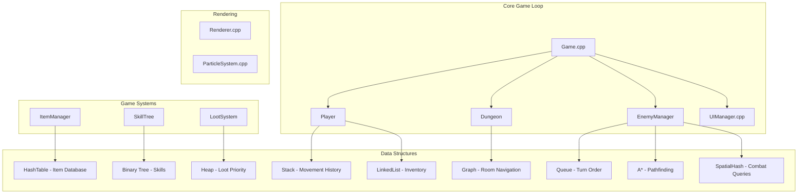
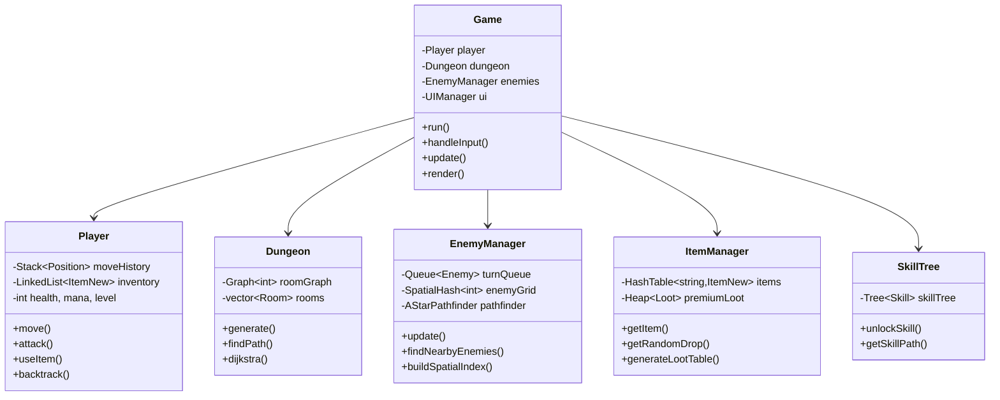

# 🎮 Dungeon Explorer - DSA Game

A roguelike dungeon crawler built with **C++ and SFML 3.0**, demonstrating **15 Data Structures and Algorithms** in a complete game implementation.

  

---

## 📋 Table of Contents

- [Game Overview](#-game-overview)
- [Architecture](#-architecture)
- [Data Structures & Algorithms](#-data-structures--algorithms)
- [Features](#-features)
- [Controls](#-controls)
- [Build Instructions](#-build-instructions)
- [Project Structure](#-project-structure)
- [Technical Details](#-technical-details)

---

## 🎯 Game Overview

Dungeon Explorer is a **turn-based roguelike** where players navigate procedurally generated dungeons across 10 floors, fight enemies with adaptive AI, collect loot, unlock skills, and progress to victory.

### Gameplay Loop



---

## 🏗️ Architecture

### System Architecture



### Class Diagram



---

## 📊 Data Structures & Algorithms

### 15 DSA Implementations

| # | DSA | Location | Purpose | Complexity |
|---|-----|----------|---------|------------|
| 1 | **Stack** | `Stack.h` | Player movement history (backtracking) | O(1) push/pop |
| 2 | **Queue** | `Queue.h` | Enemy turn order management | O(1) enqueue/dequeue |
| 3 | **Linked List** | `LinkedList.h` | Player inventory storage | O(1) insert, O(n) search |
| 4 | **Hash Table** | `HashTable.h` | Item database lookup | O(1) average lookup |
| 5 | **Heap (Max)** | `Heap.h` | Premium loot prioritization | O(log n) insert |
| 6 | **Binary Tree** | `Tree.h` | Skill tree progression | O(log n) traversal |
| 7 | **Graph** | `Graph.h` | Room connectivity | O(V+E) traversal |
| 8 | **Priority Queue** | `PriorityQueue.h` | A* open set management | O(log n) operations |
| 9 | **A* Pathfinding** | `AStar.h` | Enemy smart navigation | O(E log V) |
| 10 | **Spatial Hash** | `SpatialHash.h` | O(k) combat queries | O(1) cell lookup |
| 11 | **Object Pool** | `ObjectPool.h` | Particle memory reuse | O(1) acquire/release |
| 12 | **LRU Cache** | `LRUCache.h` | Asset memory management | O(1) get/put |
| 13 | **Path Cache** | `GameUtils.h` | A* result caching | O(1) cache hit |
| 14 | **Distance Algorithms** | `GameUtils.h` | Manhattan, Euclidean, Chebyshev | O(1) |
| 15 | **Input Debounce** | `GameUtils.h` | Key repeat prevention | O(1) |

### DSA Flow Diagram

```mermaid
flowchart TD
    subgraph Movement["Player Movement"]
        M1[WASD Input] --> M2[Stack.push Position]
        M3[B Key] --> M4[Stack.pop]
        M4 --> M5[Move to Previous]
    end
    
    subgraph Combat["Combat System"]
        C1[Player Attack] --> C2[SpatialHash.query]
        C2 --> C3[Find Nearby Enemies]
        C3 --> C4[Queue Enemy Turns]
        C4 --> C5[Process Turn Order]
    end
    
    subgraph Loot["Loot System"]
        L1[Enemy Dies] --> L2[HashTable.lookup]
        L2 --> L3[Generate Drop]
        L3 --> L4[Heap.insert if Rare]
        L4 --> L5[LinkedList.add to Inventory]
    end
    
    subgraph Navigation["Enemy AI"]
        N1[Enemy Update] --> N2[A* Pathfinding]
        N2 --> N3[Graph.getNeighbors]
        N3 --> N4[PriorityQueue Processing]
        N4 --> N5[Move Towards Player]
    end
```



---

## 🎮 Features

### Core Systems
- ✅ **Procedural Generation**: 10 unique dungeon floors
- ✅ **Turn-Based Combat**: Strategic enemy encounters
- ✅ **Loot System**: 30+ items with rarity tiers
- ✅ **Skill Tree**: 20+ skills with unlock dependencies
- ✅ **Achievement System**: 50+ achievements
- ✅ **Save/Load**: Persistent game state

### Visual Features
- ✅ **Particle Effects**: Blood, sparks, magic effects
- ✅ **Floating Text**: Damage numbers, notifications
- ✅ **Mini-map**: Real-time dungeon overview
- ✅ **DSA Visualization**: Graph paths, stack trails

---

## 🎮 Controls

| Key | Action |
|-----|--------|
| **WASD** | Move player |
| **B** | Backtrack (Stack undo) |
| **Space** | Attack nearest enemy |
| **E** | Interact (pickup, doors, stairs) |
| **I** | Toggle inventory |
| **T** | Toggle skill tree |
| **U** | Use selected item |
| **X** | Drop selected item |
| **1-5** | Activate skills |
| **M** | Toggle mini-map |
| **ESC** | Exit game |

---

## 🛠️ Build Instructions

### Prerequisites
- **C++ Compiler**: GCC 13+ or MSVC 2022
- **CMake**: 3.10+
- **SFML**: 3.0.0

### Build Commands

```bash
# Navigate to project directory
cd "path/to/DungeonExplorer"

# Generate build files
cmake -B build -G "Ninja"

# Compile
cmake --build build --config Release

# Run game
./build/Release/DungeonExplorer.exe
```

---

## 📁 Project Structure

```
DungeonExplorer/
├── include/
│   ├── DataStructures/          # 12 DSA implementations
│   │   ├── Stack.h              # LIFO container
│   │   ├── Queue.h              # FIFO container
│   │   ├── LinkedList.h         # Dynamic list
│   │   ├── HashTable.h          # Key-value store
│   │   ├── Heap.h               # Priority heap
│   │   ├── Tree.h               # Binary tree
│   │   ├── Graph.h              # Adjacency list
│   │   ├── PriorityQueue.h      # Min/max heap queue
│   │   ├── AStar.h              # A* pathfinding
│   │   ├── SpatialHash.h        # Spatial partitioning
│   │   ├── ObjectPool.h         # Memory pooling
│   │   └── LRUCache.h           # Cache eviction
│   ├── Game.h                   # Main game loop
│   ├── Player.h                 # Player entity
│   ├── Enemy.h                  # Enemy AI
│   ├── Dungeon.h                # Level generation
│   ├── GameUtils.h              # Consolidated utilities
│   └── ...
├── src/                         # Implementation files (23 files)
├── assets/
│   ├── data/                    # JSON configurations
│   │   ├── items.json           # 30+ item definitions
│   │   └── enemies.json         # 8 enemy types
│   └── kenney/                  # Tileset sprites
├── doc/                         # Additional documentation
├── build/                       # Build output
├── CMakeLists.txt               # Build configuration
└── README.md                    # This file
```

---

## 🔧 Technical Details

### Memory Management
- **Smart Pointers**: `std::unique_ptr` for ownership
- **Object Pooling**: Particle system reuses objects
- **LRU Cache**: Texture memory management

### Performance Optimizations
- **Spatial Hashing**: O(k) enemy queries vs O(n)
- **Path Caching**: Reuses A* results for common paths
- **Consolidated Utilities**: 22+ redundant includes removed

### Code Statistics
| Metric | Count |
|--------|-------|
| Source Files | 23 |
| Header Files | 25 |
| DSA Implementations | 15 |
| Lines of Code | ~15,000 |
| Items | 30+ |
| Skills | 20+ |
| Achievements | 50+ |

---

## 📜 License

Educational project for Data Structures and Algorithms demonstration.

---

**Version**: 2.0 | **Updated**: December 2025 | **Build**: ✅ Passing
